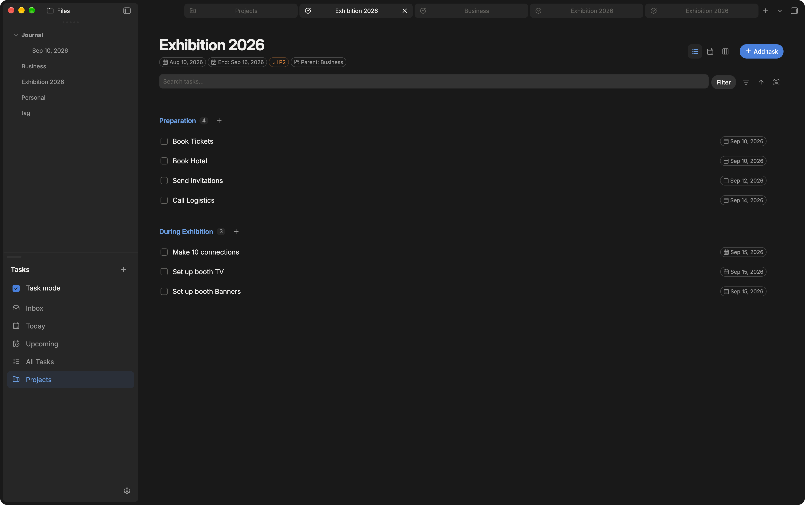
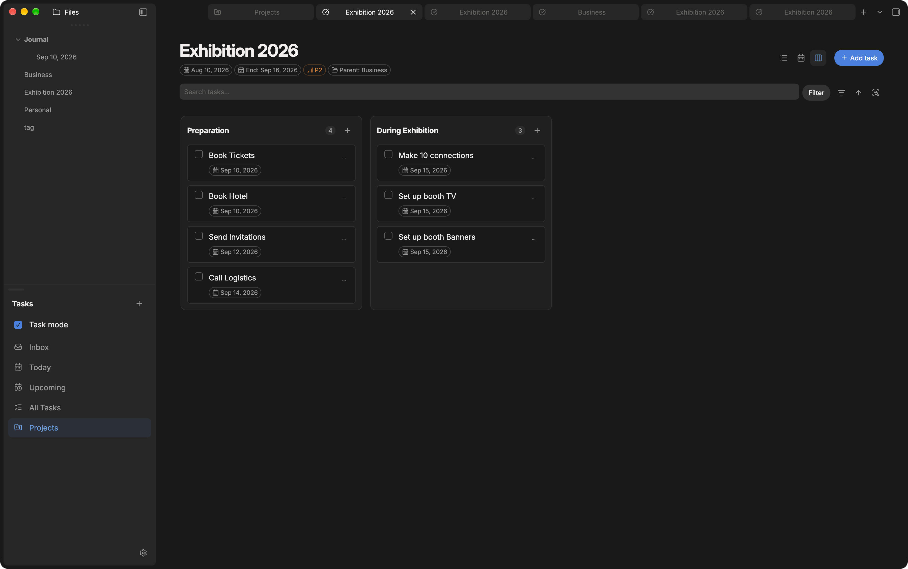
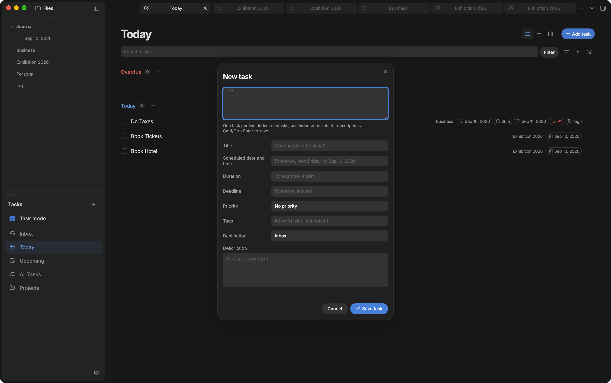
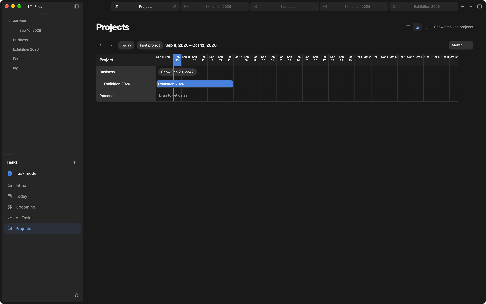
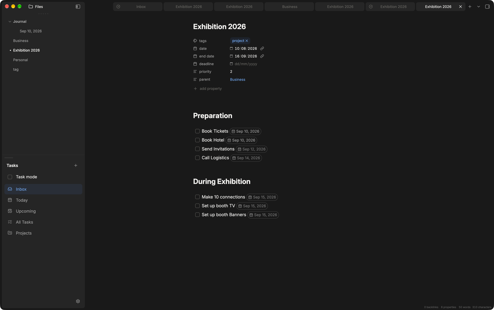

# Integrated Task Manager for Obsidian

Keep your tasks where your work already lives: in your notes. Integrated Task Manager brings checklists from across your vault into lists, calendars, Kanban boards, and project timelines. Every change saves back to the original Markdown note.

Works on **desktop and mobile** with **Obsidian 1.7.2 or newer**. Tasks are indexed locally; the plugin does not upload your notes or task data to an external service.



## Get started

1. Copy `main.js`, `manifest.json`, and `styles.css` from this repository into your vault’s `.obsidian/plugins/integrated-task-manager/` folder.
2. Reload Obsidian and enable **Integrated Task Manager** in **Settings → Community plugins**.
3. Click **Open task manager** in the ribbon, or run **Open Inbox** from the command palette.
4. Choose **Add task** and type something like `Send proposal tomorrow at 9am {next Friday} p1`.

Quick-created tasks go to `Inbox.md` by default. You can choose a different inbox note in the plugin settings.

## Find the right tasks

| View | What you’ll find |
| --- | --- |
| **Inbox** | Tasks in your chosen inbox note. |
| **Today** | Tasks for today, with overdue work shown separately. |
| **Upcoming** | Future tasks, organized by date. |
| **All Tasks** | Tasks from Markdown notes throughout your vault. |
| **Projects** | Notes tagged `#project`, with progress and project dates. |
| **Tags** | Task tags with open and completed counts; open a tag to see its matching tasks. |

The sidebar uses a compact file-style tree. Its icon toolbar provides **Create task**, **Create project**, and **Task mode**. Expand Projects or Tags for direct access, or click their labels to open the full lists. Creating a project makes a named Markdown note with the `project` frontmatter tag. Tag pages support the existing task layouts, filters, and editing tools; new tasks created there inherit the tag. With Task mode on, Markdown notes linked by task tags such as `#[[work]]` open as tag task views, showing matching tasks across the vault. Opening a tag from the sidebar or Tags list opens its note and enables Task mode; tags without an existing note still open as tag lists.

Use **Create new smart list** to save a named set of filters (including AND/OR conditions), sorting, and grouping. Saved lists appear under **Smart Lists** in the sidebar and update as tasks change. With a saved list open, **Edit smart list** changes its definition and **Delete smart list** removes the saved list without deleting tasks. Smart lists are stored in the plugin’s workspace settings.

Open **Dashboard** from the sidebar or run **Open Task Dashboard** for Today and Upcoming cards in a 40/60 split, with Projects and Calendar cards in a 40/60 split below. Each card has an accent-colored border and a title above it. Cards stack on narrow screens.

Today and Upcoming use the earlier of a task’s scheduled date and deadline. Undated tasks remain available in Inbox, All Tasks, and their source note’s task view.

Search task titles, descriptions, and tags. Filter by title, status, scheduled date or time, deadline, duration, priority, tags, source note, or section. Filters support matching values, missing properties, and date or duration ranges where applicable. After completing a condition, use the inline AND / OR control to add another condition for that property. AND is evaluated before OR; separate property filters must all match.

Sort in either direction and group by task properties, or choose **None** for a flat list. **View default** keeps the view’s usual organization, including note headings in project views. Visible subtasks stay beside their parents. Search, filters, sorting, and grouping reset when you switch to a different view or page.

## Choose how you work

### List

See tasks and their properties at a glance. Click a checkbox to complete a task, or click its title or body to edit it. Drag tasks to reorder them or move them between sections and notes. Subtasks and descriptions travel with their parent.

Use the **+** beside a group or heading to add a task with that destination or group’s properties already filled in—even when the section is empty.

### Calendar

Switch between **Day, Week, Month, and Year**. Tasks appear on their scheduled date, falling back to their deadline when no scheduled date exists.

- Drag a task to another date or time to reschedule it.
- In Day and Week, drag across time slots to create a task with a start time and duration.
- Resize a timed task to adjust its start or finish in 15-minute steps.
- Keep tasks without a time in the separate untimed area.

In Today and Upcoming, switching to Calendar lets you browse the full dated task schedule.

### Kanban

Turn your task groups into columns. Use note sections for a project board, or group by status, priority, dates, or other properties. Drag cards between supported columns to update their property or destination. Grouping by **Status** gives you **Open** and **Completed** columns.



## Capture tasks naturally

Use the task editor’s text box for quick entry, or fill in the individual fields. Scheduled dates and deadlines can each have their own time.

```text
Call the venue tomorrow at 9am 30m p1
Send invitations next Friday {next Monday at noon} #[[event]]
Book tickets ~[[Exhibition 2026#Preparation]]
```

The editor understands dates such as `today`, `tomorrow`, and `next Friday`, plus times such as `9pm`, `21:00`, `noon`, and `midnight`. A time on its own, such as `Call at 9pm`, uses the next occurrence of that time.

Paste several tasks at once, one per line. Indent subtasks; use indented plain bullets for descriptions. Each task’s dates and properties are parsed separately. The individual property fields apply to the first task, and the whole batch saves to the same destination. **Enter** adds a line; **Cmd/Ctrl+Enter** saves.



### Markdown syntax

Tasks remain ordinary checklists with optional properties at the end:

```markdown
- [ ] Send proposal [[2026-09-11]] 09:00 1h30m {[[2026-09-14]] 12:00} p1 #[[work]]
  - Include the revised estimate.
  - [ ] Check the pricing 15m
```

| Property | Syntax |
| --- | --- |
| Scheduled date and time | `[[2026-09-11]] 09:00` |
| Duration | `30m`, `2h`, or `1h30m` |
| Deadline and optional time | `{[[2026-09-14]] 12:00}` |
| Priority | `p1` (high), `p2` (medium), `p3` (low) |
| Tags | `#[[work]] #[[client notes]]` |
| Destination in the editor | `~[[Note]]` or `~[[Note#Heading]]` |

Dates use **Date format** when set; it is empty by default and falls back to your **Daily Notes** date format, then `YYYY-MM-DD`. ISO dates are also supported. Turn off **Link dates** to save plain dates instead of links. These settings apply to new edits. Click **Update dates** in settings to convert scheduled and deadline tokens in all tasks across the vault, including completed tasks, to the selected format and link style. The updater preserves task text and times and skips frontmatter and fenced code blocks.

Tags can contain spaces. They appear as badges and work with search, filters, sorting, and grouping. Duplicate tags are saved once.

Indented checklists become subtasks. Indented plain bullets become a task’s description, which you can search and edit in the task editor. Descriptions stay hidden in task layouts to keep them compact.

Choose a destination from the editor or type `~[[Note#Heading]]`. Tasks go at the top or bottom of the first checklist in that section, according to **New task position**. A note-only destination uses the area before the first heading. If there’s no checklist, one is started in that area; introductory prose and frontmatter are preserved.

## Turn notes into projects

Run **Convert to project** on a note, or add `#project` to its body or frontmatter tags. The command adds missing project properties while preserving existing values and tags.

Enable **Task mode** to open project notes as task views. Existing project tabs switch too, and turning it off restores their Markdown views. Ordinary notes stay in Markdown. Opening a project from Projects automatically enables Task mode and opens it in a new tab.

Use headings to organize a project’s tasks into sections. **Section heading level** selects Heading 1–6 for sections and task destinations; the default is Heading 1. Add properties to track the project itself:

```yaml
---
tags: [project]
date: 2026-09-10
end date: 2026-09-18
deadline: 2026-09-20
priority: p2
parent: "[[Business]]"
---
```

The optional `parent` link nests a project under another project. Start date, end date, deadline, and priority appear as badges. `start-date` and `end-date` aliases are supported, as are priorities written as `1`–`3` or `high`/`medium`/`low`.

Projects show completion percentages, including subtasks. Add `#archived` to hide a project from the default Projects list; **Show archived projects** brings it back. Its tasks still appear in other task views.

### Plan projects on a timeline

Choose **Gantt** in Projects to see the project hierarchy with week, month, or quarter zoom. Scroll horizontally in either direction to explore dates beyond the current window; the timeline continues as you scroll, with project labels pinned on the left.

- Drag a bar’s edges to change its start or finish date.
- Bars finish at the deadline when one exists, otherwise at the end date.
- When both exist, a separate draggable marker lets you adjust the end date independently.
- Click inside a bar to add a missing end date, or drag across an undated row to set start and end dates together.
- Focus an edge handle and use the arrow keys to adjust it one day at a time.

Changes save to the project note’s properties.



## Keep working in your notes

In Live Preview and Reading view, dates, durations, deadlines, and priorities appear as small badges. In Live Preview, placing the caret in a property reveals its original text. Date links still open their notes, and Source mode stays plain Markdown.

With Task mode off, enter natural dates directly in a checklist (`@` is optional):

```markdown
- [ ] Call the venue tomorrow {next Friday}
```

Press Enter or move to another line to convert recognized dates to your configured format and put task properties in a consistent order. Only the last scheduled-date expression and the last `{deadline}` expression are converted; earlier mentions and unrecognized expressions remain unchanged.

**Cmd/Ctrl-click a checkbox** to open its task editor from a note. On mobile, **press and hold the checkbox**. Both work in Live Preview and Reading view.



## Edit several tasks together

| Action | Gesture |
| --- | --- |
| Select a task | Right-click |
| Select a visible range | Shift + right-click |
| Add to the selection | Cmd/Ctrl + right-click |
| Clear selection | Escape on a focused task, or **Clear selection** |

Choose **Edit task properties** from the selection toolbar or command palette to change dates, times, duration, priority, tags, destination, or description together. Only fields you edit are applied. **Mixed — unchanged** means the selected tasks have different values; **Clear** removes a property explicitly.

Drag a selected task to move the selection together, including subtasks and descriptions. Calendar drops reschedule the selection. **Delete task** removes the selected tasks and their subtasks.

## Settings and commands

Settings let you choose your **Inbox note**, toggle **Task mode** and **Link dates**, set **New task position** to Top or Bottom, and control title wrapping separately for List, Calendar, and Kanban.

From the command palette, you can open any main view, **Create new task**, **Convert to project**, **Toggle task mode**, **Edit task properties**, and switch task or project layouts. **Search task in list** focuses search in an active project task view while Task mode is on. Assign hotkeys through Obsidian’s Hotkeys settings.

## Development

```bash
npm install
npm test
npm run build
```

Use `npm run dev` to rebuild as you work. Copy the built plugin files into a test vault using the installation steps above.

## License

[MIT](LICENSE)
