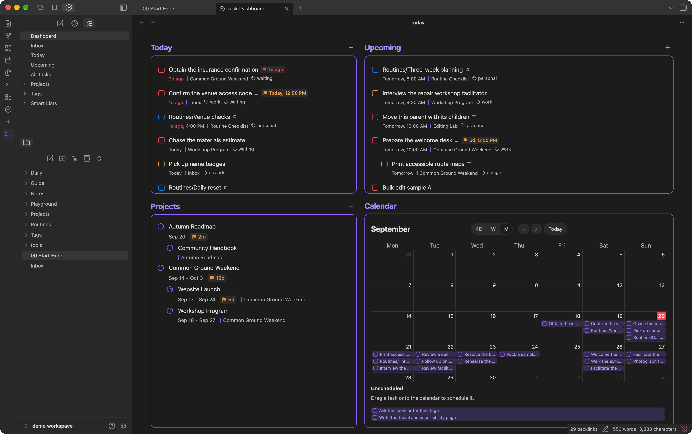
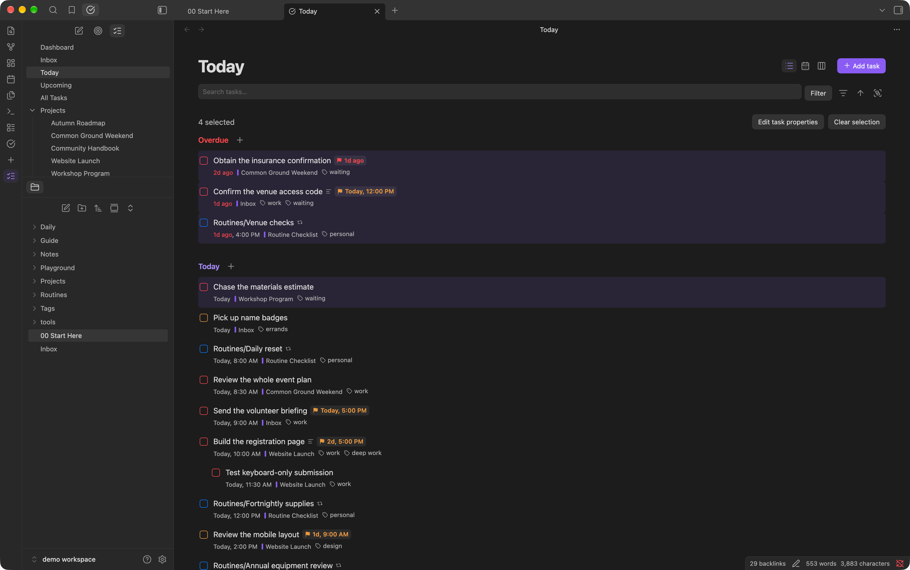

# Integrated Task Manager for Obsidian

Keep your tasks alongside the notes that give them context. Integrated Task Manager brings checklists from across your vault into one place, with lists, calendars, Kanban boards, and project timelines. Complete or edit a task in any view, and the change is saved in its original note.

Start your day with a dashboard of today's work, upcoming tasks, projects, and your calendar.

Works on **desktop and mobile**, with **Obsidian 1.7.2 or newer**. Your tasks stay in your vault; the plugin does not upload your notes or task data to an external service.

## Get started

Once the plugin is enabled, click **Open task manager** in Obsidian's ribbon to open the task sidebar.

1. Open **Inbox** and choose **Add task**.
2. Type something like `Call the venue tomorrow at 9am`.
3. Add a deadline, priority, or other details if you need them, then save.
4. Open **Today**, **Upcoming**, or **Dashboard** to see your plan.

Quick-created tasks go to `Inbox.md` by default. You can choose another inbox note in settings. Checklists already in your notes appear in **All Tasks**.

## Find what needs your attention

| View | Use it to… |
| --- | --- |
| **Dashboard** | Get an overview of your day and projects. |
| **Inbox** | Capture tasks and sort them out later. |
| **Today** | Focus on today's tasks and catch overdue work. |
| **Upcoming** | Look ahead at future tasks, organized by date. |
| **All Tasks** | See tasks from across your vault, including those without dates. |
| **Projects** | Review project progress and open a project's tasks. |
| **Tags** | Bring related tasks together across different notes. |
| **Smart Lists** | Return to your own saved views of the work. |

Today and Upcoming consider both the scheduled date and the deadline, using whichever comes first. Tasks without either date remain available in All Tasks and their source notes.

Search by task title, description, or tag. Narrow the results by priority, dates, duration, status, note, or section. Sort and group the results to suit the way you're working.

For a view you'll use again, choose **Create new smart list**. Save a list such as “Quick wins,” “Waiting on others,” or “High-priority work.” Smart lists update as your tasks change. Deleting a smart list leaves its tasks intact.

## Capture the task and its details

Write dates naturally—such as “tomorrow,” “next Friday,” or “at noon”—or use the task editor's individual fields.

A task can include:

- A **scheduled date and time** for when you plan to work on it.
- A **deadline**, with its own optional time, for when it needs to be finished.
- A **duration** to help you make room for it.
- A **priority**, **tags**, and a **description**.
- A **destination** note or heading, so it lands in the right place.

Break larger tasks into subtasks. You can also paste several tasks into the editor at once, one per line, with indented subtasks underneath. Press **Enter** for another line and **Cmd/Ctrl+Enter** to save.

## Choose a layout

### List: work through the details

Click a checkbox to complete a task, or click its title to edit it. Drag tasks to reorder them or move them between sections and notes. Subtasks and descriptions travel with their parent.

Use the **+** beside a group or heading to add a task there. Click a task's source label to return to the note it came from.

### Calendar: make time for your work

See your schedule across four days, a week, or a month. Day and year views are also available from the command palette.

Drag tasks to a new date or time to reschedule them. In the daily and weekly layouts, drag across empty time slots to create a task, or resize a timed task to change how much time it takes.

Turn on **Plan tasks** to see unscheduled tasks beside the calendar, then drag them into your schedule. Tasks without a time stay in a separate area above the time slots.

The calendar places a task on its scheduled date, or on its deadline if it has no scheduled date.

### Kanban: organize work into columns

Use your note's sections as a board, or group tasks by properties such as priority or status. Drag between supported columns to update the task's section or property. Grouping by **Status** gives you Open and Completed columns.

## Turn notes into projects

Create a project from the task sidebar, or open an existing note and run **Convert to project** from the command palette. Use headings to divide its tasks into sections, and give the project dates, a deadline, and a priority.

Projects show completion progress, including subtasks. Assign a parent project to organize related projects together.

**Task mode** opens project notes as task views. Opening a project from the Projects list enables it automatically. Turn Task mode off whenever you want to return to the regular note view.

Add the `archived` tag to a project note to hide it from the default Projects list. **Show archived projects** brings it back; its tasks remain available in other task views.

### See the bigger picture with Gantt

Switch Projects to **Gantt** to see your projects on a timeline. Choose month, quarter, year, or five-year views to plan at different scales.

Drag a bar's edges to adjust a project's start and end dates. For a project without a date range, drag across its row to plan one. Changes are saved back to the project note.

## Keep working in your notes

You can continue writing and checking off tasks directly in your notes. In Live Preview and Reading view, the plugin presents task dates, deadlines, and tags alongside the task, with checkbox colors indicating priority.

**Cmd/Ctrl-click a checkbox** to open the task editor. On mobile, **press and hold the checkbox**.

With Task mode off, you can type a natural date into a checklist, such as “Call the venue tomorrow.” Press Enter or move to another line to turn the recognized date into a saved schedule.

Tags connect related work across your vault. Open a tag from the sidebar to see its tasks; a task created in that view inherits the tag. When a tag has a linked note, Task mode can show that note as a tag task view too.

## Update several tasks at once

Select tasks to change their dates, priorities, tags, or other details together.

| Action | Gesture |
| --- | --- |
| Select a task | Right-click |
| Select a range | Shift + right-click |
| Add to your selection | Cmd/Ctrl + right-click |
| Clear your selection | Choose **Clear selection** |

Choose **Edit task properties** to make a shared change. Only the fields you edit are applied; **Mixed — unchanged** preserves each task's existing value.

You can also drag a selection to move tasks together, drop it onto the calendar to reschedule it, or delete selected tasks along with their subtasks.

## Build recurring routines

Use recurring tasks for daily habits, weekly reviews, or occasional reminders.

1. Create a note for the routine, such as **Weekly review**.
2. In that note's properties, add the tag `recurring-task` and a text property named `repeat`, with a value such as `every friday`.
3. In any checklist, link to that note and give the task a scheduled date.

Check off the recurring task to record its completion and advance it to the next occurrence. The task stays open for next time, and its routine note keeps the history.

You can also use **Skip recurring task** or **Fail recurring task** from the command palette. In a regular note, place your cursor on the task first; in Task mode, select one recurring task.

Repeat rules include every day, every week, every other week, every month, every year, and named weekdays. Overdue routines advance one occurrence at a time.

## Make it fit your workflow

In the plugin settings, you can choose your inbox, decide whether new tasks go at the top or bottom, and select which heading level organizes project sections. Adjust title wrapping, row height, hover highlighting, task counts, and the details shown in lists and boards.

Choose your preferred date format and whether dates link to notes. These choices apply to new edits; use **Update dates** to apply them to existing tasks and recurring-task history.

Search for **Integrated Task Manager** in Obsidian's command palette to open views, create tasks, switch layouts, and access other actions. Assign hotkeys to your favorites in Obsidian's Hotkeys settings.

## Manual installation

1. Place `main.js`, `manifest.json`, and `styles.css` in your vault's `.obsidian/plugins/integrated-task-manager/` folder.
2. Reload Obsidian.
3. Enable **Integrated Task Manager** under **Settings → Community plugins**.

## License

[MIT](LICENSE)
