# Integrated Task Manager for Obsidian

Plan your work from the checklists already in your notes. Integrated Task Manager gathers every `- [ ]` in your vault into one task manager, with Today and Upcoming views, projects, calendars, Kanban boards and a Gantt timeline. Complete or edit a task anywhere and the change is written back to the note it came from, as plain Markdown.

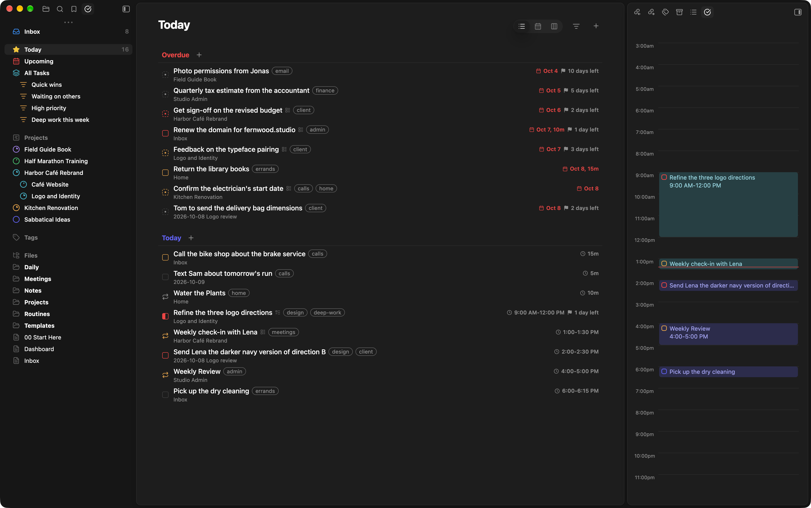

- **Your notes stay the source of truth.** A task is a checklist line. Its date, deadline, priority and tags are readable text on that line, so your notes still make sense without the plugin.
- **Views for every question.** Inbox, Today, Upcoming, All Tasks, Projects, Tags, and smart lists you save yourself.
- **List, calendar or board.** Any task view can switch layout, and the Projects list switches to a Gantt chart.
- **Projects are notes.** Tag a note `project` and its headings become sections, with dates, a deadline, a colour and progress.
- **A sidebar that follows you.** The Task details sidebar shows today's hours, your tasks with no date, a note's tasks, the task you selected, or else what's coming up.
- **Live task lists in any note.** A `task-query` block turns a daily note or a dashboard into a checkable list.
- **Fast to drive.** Select many tasks at once, use single-key shortcuts, and undo any change.

Works on **desktop and mobile** with **Obsidian 1.7.2 or newer**. Your tasks stay in your vault: the plugin does not send your notes or tasks anywhere.

## Get started

1. In Obsidian, open **Settings → Community plugins → Browse**, search for **Integrated Task Manager**, then install and enable it.
2. Click **Open task manager** in the ribbon to open the task sidebar, where your views, projects and tags live. The Task details sidebar opens on the right.
3. Open **Inbox**, click **+**, and type something like `Call the venue tomorrow at 9am p1`. Press Enter to add it.
4. Open **Today** or **Upcoming** to see your plan.

New tasks go to `Inbox.md` unless you pick another inbox note in settings. Checklists already in your notes appear in **All Tasks** straight away.

## Tasks are plain Markdown

Every checklist item in your vault is a task. Its properties go at the end of the line, after the title:

```markdown
# Drafting
- [/] Draft chapter 3: pigeons and doves 2026-10-12 09:00 2h p2 #writing #deep-work
- [ ] Commission the cover illustration 2026-11-23 1h {2026-12-08} p2 #design
- [?] Photo permissions from Jonas 2026-10-04 {2026-10-19} #email
- [ ] Water the plants 2026-10-09 every week
- [ ] Renew passport >2026-11-01
- [x] Outline all twelve chapters 2026-08-15 3h #writing ✓2026-08-20
```

| Write | It means |
| --- | --- |
| `2026-10-12` or `[[2026-10-12]]` | Scheduled date: the day you plan to work on it |
| `2026-10-12 09:00` | Scheduled date and time |
| `2h`, `45m`, `1h30m` | Duration |
| `{2026-10-19}` | Deadline, with an optional time: `{2026-10-19 17:00}` |
| `p1`, `p2`, `p3` | Priority: high, medium, low |
| `#writing` | Tag |
| `every week` | Repeat (see [Repeat tasks and keep routines](#repeat-tasks-and-keep-routines)) |
| `>2026-11-01` or `>someday` | Hidden until that day, or set aside with no date (see [Snooze](#snooze-tasks-you-cant-act-on-yet)) |
| `✓2026-08-20` | The day it was completed |

The character in the checkbox is the task's status:

| Markdown | Status |
| --- | --- |
| `- [ ]` | To do |
| `- [/]` | In progress |
| `- [?]` | Waiting |
| `- [x]` | Done |
| `- [-]` | Cancelled |

Indented checklists under a task are its subtasks, and indented bullets are its notes. Other checkbox characters, such as `[!]`, are not treated as tasks.

Dates are written in your **Date format** (your Daily notes format by default, or `YYYY-MM-DD`), as plain dates or as `[[date]]` links. The screenshots use `MMM D, YYYY`. Tags are written as `#tag`, or as `#[[tag]]` if you prefer tags that link to a note.

You rarely type the syntax yourself. When you add or edit a task in a task view, you can write `tomorrow 3pm`, `next friday`, `p1`, `#work` or `every monday` in the title, or `{friday}` for a deadline, and each one is highlighted as you type and saved in the right form. A date written in words only counts at the end of the title, so "Call Sam tomorrow about dinner" keeps its title. Type `~[[Note]]` or `~[[Note#Heading]]` to send the task to that note or heading.

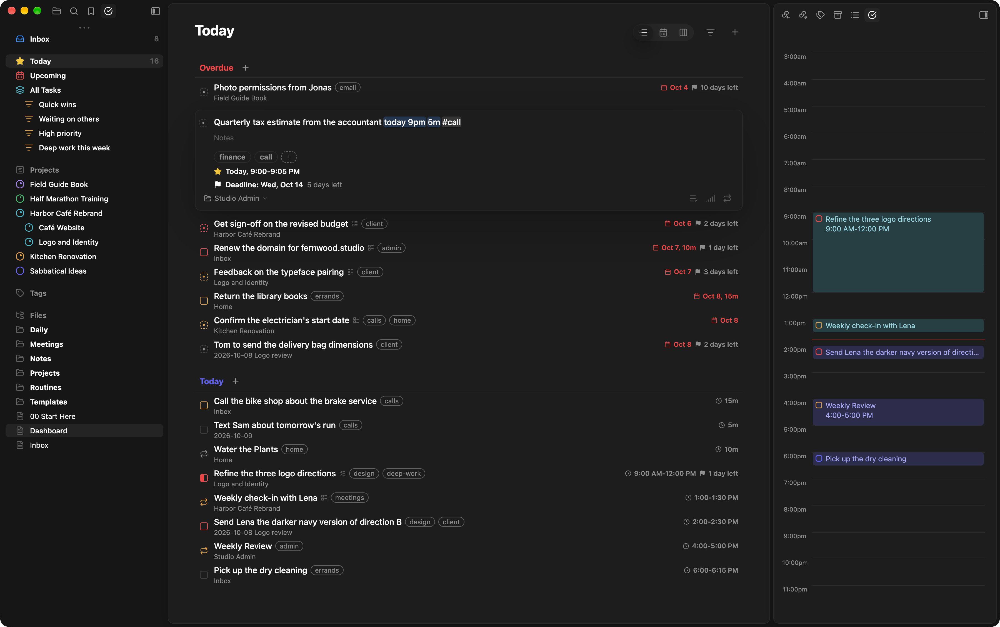

## Find what needs your attention

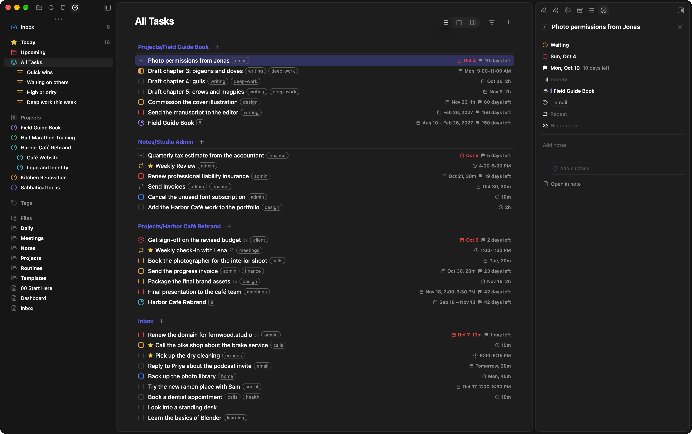

| View | Use it to… |
| --- | --- |
| **Inbox** | Capture tasks now and sort them out later. |
| **Today** | Work through today's tasks, with anything overdue at the top. |
| **Upcoming** | Look ahead at future tasks, grouped by date. |
| **All Tasks** | See every open task in your vault, including those without dates. |
| **Projects** | Review your projects and their progress, as a list or a Gantt chart. |
| **Tags** | Bring related tasks together across notes. |
| **Smart lists** | Return to your own saved views, such as "Quick wins" or "Waiting on others". |

Today and Upcoming use a task's scheduled date or its deadline, whichever comes first. Tasks with neither stay in All Tasks, their projects and their notes.

Press **Cmd/Ctrl+K** in a task view (or run **Quick switch to view, project, tag, or task**) to jump to any view, project, tag, smart list or open task by typing its name.

### Filter, sort and group

Click the filter button at the top of a view to open **View options**. Pick several statuses, priorities, tags or notes at once, or a date range such as **Overdue**, **Today** or **Next 7 days**. Date ranges stay relative, so "Next 7 days" always means the coming week. **More conditions…** adds anything else: "is not", a range between two dates, or conditions joined with AND and OR.

Each view remembers its own options and layout. To keep a setup, choose **Convert to smart list** at the bottom of View options and give it a name. Smart lists appear in the task sidebar under **All Tasks** and update as your tasks change. To change a smart list later, adjust its View options and choose **Update smart list** at the bottom.

### The Task details sidebar

The Task details sidebar sits in Obsidian's right sidebar. What it shows follows what you're looking at:

- **Today:** today's hours. Drag a task onto an hour to schedule it, or click an hour to add a task there.
- **A calendar, or Upcoming:** that view's tasks with no date. Drag one onto a day to give it a date.
- **A note:** the note's tasks. Put the cursor on a checklist line to see and edit its details.
- **A selected task:** its title, properties, notes and subtasks, all editable in place. With several tasks selected, change a property once and every selected task follows.
- **Nothing else:** your upcoming tasks, by date. Click one to see its details. Click the **Upcoming** heading to show Inbox, Today, All Tasks or one of your smart lists here instead, and use the filter button beside it to filter, sort and group that list.

In the title, Enter saves what you typed and Shift+Enter moves on to the notes (a task card in the list works the same way). Press Escape to go back to the hours or the list. If you close the sidebar, run **Open task details sidebar** to bring it back.

## Choose a layout

Every task view switches between list, calendar and Kanban with the buttons at its top right.

### List

Click a checkbox to complete a task, or double-click a task to open it. Click a group's heading to fold its tasks away, and click it again to bring them back. Drag tasks to reorder them, move them between sections and notes, or nest them: drag right to make a task a subtask of the one above, left to move it out. Subtasks and notes travel with their task.

You can also drop tasks on the task sidebar: on **Inbox**, a project or a note to move them there, on **Today** to schedule them for today, or on a tag to add it. Everything you can do by dragging also works from the keyboard (see [Keyboard shortcuts](#keyboard-shortcuts)).

### Calendar

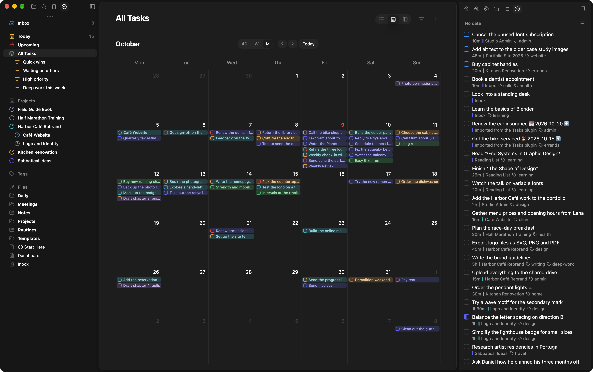

See your tasks across four days, a week or a month (day and year views are in the command palette). A task sits on its scheduled date, or on its deadline if it has no scheduled date, tinted with its project's colour.

Drag a task to another day or time to reschedule it. In the day, 4-day and week layouts, drag across empty time to create a task, or drag the edge of a timed task to change how long it takes. Tasks with a date but no time sit in the row above the hours.

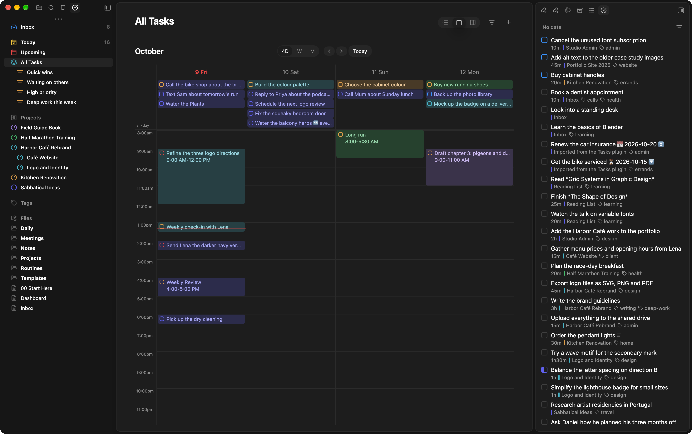

### Kanban

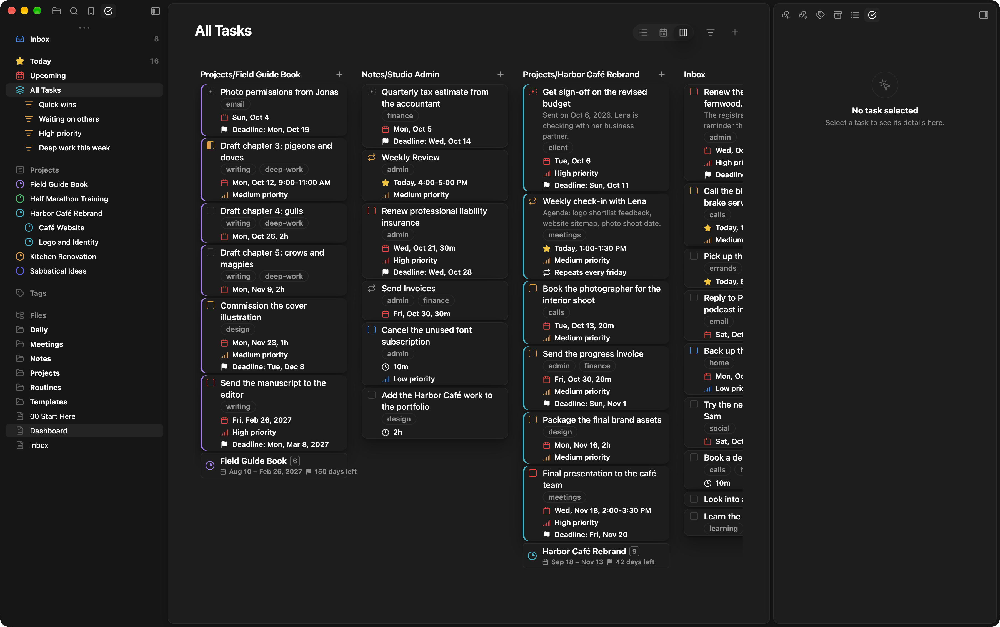

A board's columns follow the view's grouping: a project's sections, Today's overdue and today, Upcoming's dates, All Tasks' notes, or any property such as priority. Group by **Status** for To do, In progress, Waiting, Done and Cancelled columns. Drag a card to another column to change its section or property.

## Turn notes into projects

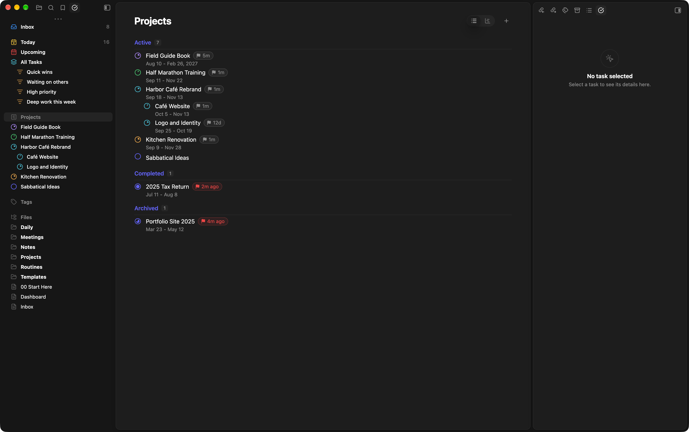

A project is a note tagged `project`. Create one with **+** in the Projects view, run **Convert to project** on any note, or type a new name when you move a task to a project and choose **Create project**. Headings in the note become the project's sections.

A project's properties live in the note's frontmatter:

```yaml
tags: [project, writing]
date: 2026-08-10        # start date
end date: 2027-02-26
deadline: 2027-03-08
priority: 3
color: purple           # or a hex colour such as "#3b82f6"
parent: "[[Studio Admin]]"
```

You don't have to edit them by hand: the **…** beside a project's title, or a right-click on it in the Projects list, sets its priority, dates, deadline, parent, tags, colour and name, and can archive, open or delete it. Subprojects appear under their parent, and use its colour unless they have their own.

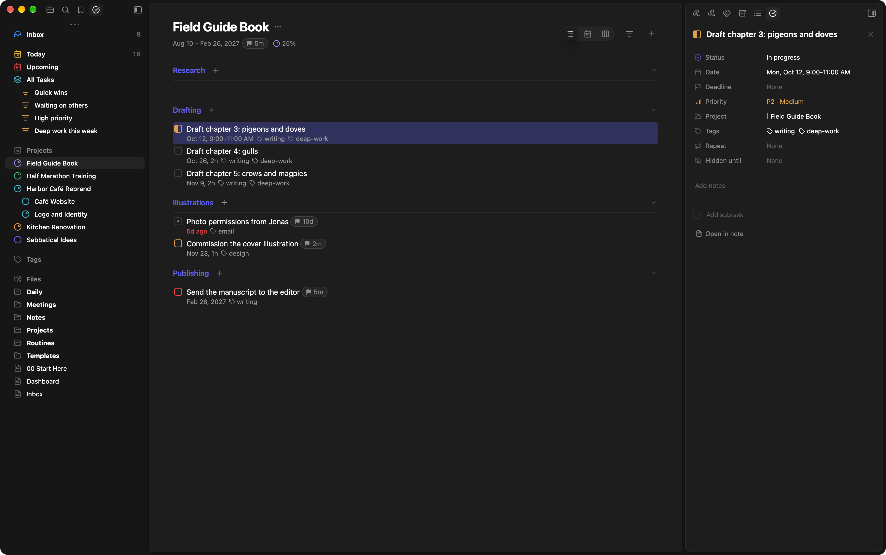

Projects show their progress, counting subtasks. When every task is done the project moves to **Completed**, and adding an open task makes it active again. Archive a project from its **…** menu (or tag the note `archived`) to move it to **Archived** and out of the sidebar; its tasks stay in other views.

Turn on **Task mode** (in the task sidebar, the ribbon, or with **Toggle task mode**) to open project notes as task views. Turn it off to edit them as regular notes.

### Plan on a timeline

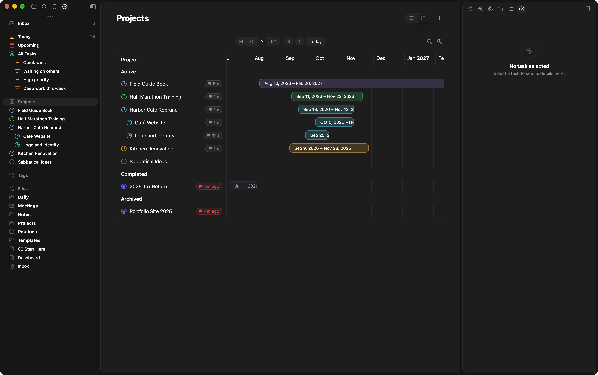

Switch the Projects view to **Gantt** to see your projects on a timeline. Choose month, quarter, year or five-year views, zoom with the buttons, the **+** and **-** keys or Ctrl/Cmd and the mouse wheel, and drag with the right mouse button to move around. Drag a bar's edges to change a project's start and end dates, or drag across an empty row to give a project its dates. Changes are saved to the project note.

## Keep working in your notes

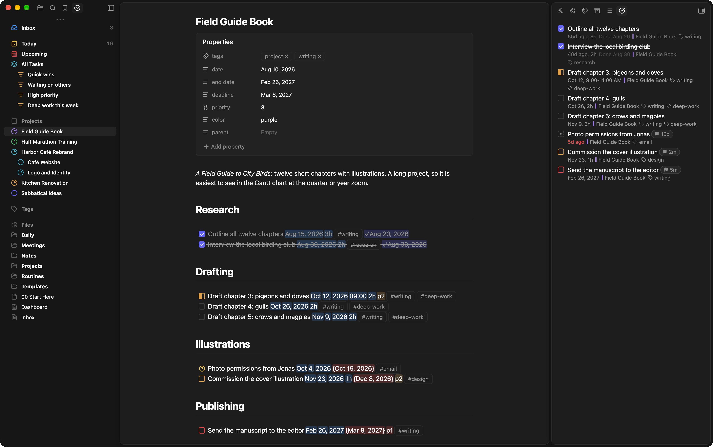

You can keep writing and checking off tasks in your notes as usual. In Live Preview and Reading view, a task's dates, deadline, priority and other properties are highlighted in the colour of what they set, and the checkbox takes its priority's colour.

- **Cmd/Ctrl-click a checkbox** to open the task. On mobile, press and hold it.
- With Task mode off, end a checklist line with a date in words, such as "Call the venue tomorrow", and it becomes a real date when you press Enter or leave the line.
- With the note open, the Task details sidebar lists the note's tasks, so you can see and change their properties without touching the syntax.

## Show tasks inside any note

Add a `task-query` block to a daily note, a project hub or a dashboard to show a live list of tasks there. Run **Insert task query** to start one. Put several blocks in one note to build a dashboard or a weekly review, like this one:

````markdown
```task-query
title: Overdue
view: overdue
```

```task-query
title: Deadlines in the next 7 days
deadline: before in 7 days
sort: deadline
```

```task-query
title: Waiting on others
status: waiting
group: source
```
````

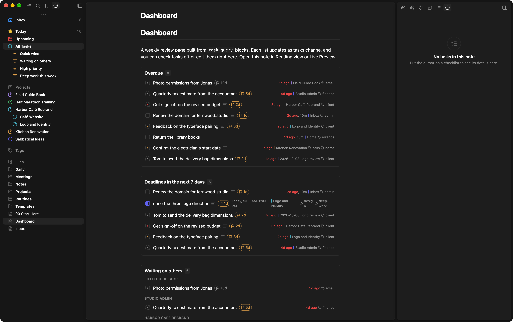

Tasks look as they do in your task views, in the style you chose. Check them off, click a tag to open its tasks, or click a title or date to edit the task right from the note: it opens in the task editor, or with three panes in the Task details sidebar.

Add `layout: board` to show the tasks as a board, with a column for each status (or for each group, with `group`). Add `layout: calendar` for a week calendar, where you can page through the weeks, drag a task to another day or time, and drag across empty time to add one. `layout: calendar month` opens on a month instead, and a date after it opens on that date's month or week, as in `layout: calendar month 2026-11-01` or `layout: calendar next monday`.

Write one option per line:

| Option | Examples |
| --- | --- |
| `view` | `today`, `upcoming`, `inbox`, `all`, `overdue` |
| `smart list` | `Quick wins` (uses that list's filters, sort and grouping) |
| `project` | `[[Website Refresh]]`, or `this` for the note the block is in |
| `note` | `this`, `[[Inbox]]` (tasks written in that note) |
| Any property | `priority: 1, 2` · `tags: work or home` · `status: in progress, waiting` · `repeat: has` · `hidden until: someday` · `task title: contains report` |
| Dates | `deadline: before next friday` · `scheduled: between today and in 7 days` · `completed: after 7 days ago` · `deadline: missing` |
| `search` | words in the title, notes or tags |
| `sort`, `group` | `sort: priority desc` · `group: source` |
| `layout` | `list` (the default), `board`, `calendar`, or `calendar` followed by `day`, `4 days`, `week` or `month` and a date to open on |
| `limit` | how many tasks a list or board shows (50 by default) |
| `title` | a heading for the list |
| `show completed` | `yes` to include completed tasks |

Dates such as `today` or `next friday` are worked out each time the list is shown. If a line isn't understood, the block says which one and why. The Tasks plugin's `tasks` blocks are left alone, so both plugins can be used side by side.

## Change many tasks at once

Click a task to select it, Shift-click to select a range, and Cmd/Ctrl-click to add to the selection (Cmd/Ctrl+A selects the whole view). Then right-click, or press a key, to change every selected task at once:

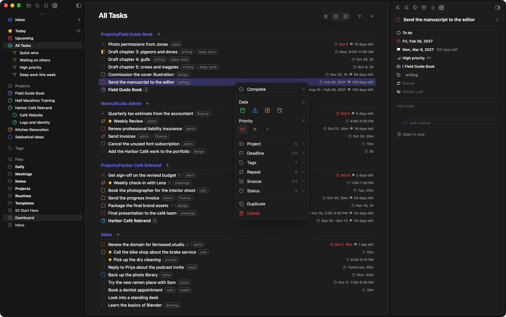

- **Complete** or **Reopen**
- **Date**: Today, Tomorrow, Next week, or any date, time and duration
- **Priority**, **Project**, **Deadline**, **Tags**, **Repeat**, **Snooze** and **Status**
- **Duplicate** (with notes and subtasks) and **Delete**

You can also drag a selection to move it, or drop it on the calendar to reschedule it.

## Keyboard shortcuts

In a list:

| Key | Action |
| --- | --- |
| ↑ / ↓, Home / End | Move between tasks |
| Enter or Space | Open the task |
| Shift + ↑ / ↓ | Select a range |
| Alt + ↑ / ↓ | Move the task up or down |
| Alt + → / ← | Make it a subtask of the task above, or move it out of its parent |
| Cmd/Ctrl + K | Jump to a view, project, tag, smart list or task |
| Cmd/Ctrl + Z | Undo the last change |
| Cmd/Ctrl + Shift + Z (or Ctrl + Y) | Redo |

With tasks selected:

| Key | Action |
| --- | --- |
| E | Open the task menu |
| M | Move to another section, column or note |
| Shift + T | Schedule for today |
| D / Shift + D | Date, time and duration / Deadline |
| P | Priority (press again to cycle) |
| T | Tags |
| G | Project |
| R | Repeat |
| S | Status (press again to cycle) |
| Shift + S | Snooze |
| C | Complete, or reopen |
| Cmd/Ctrl + C / V | Copy as Markdown / Paste |
| Cmd/Ctrl + D | Duplicate |
| Delete or Backspace | Delete, with subtasks |

## Repeat tasks and keep routines

End a task with a rule such as `every day`, `every 2 weeks`, `every month` or `every monday`. Completing it moves it to its next date instead of checking it off, and a deadline moves with it. A task can have several rules, such as `every monday every friday`.

For a habit you want a history of, make a routine note:

1. Create a note such as **Weekly review**, with the tag `recurring-task` and a `repeat` property such as `every friday`.
2. In any checklist, link to that note and give the task a scheduled date.

Each time you check the task off (or cancel it), it moves to its next date and the routine note records the day: `COMPLETED: 2026-09-19` or `CANCELED: 2026-09-26`.

## Snooze tasks you can't act on yet

End a task with `>` and a date, such as `>2026-11-01`, to hide it from Inbox, Today and Upcoming until that day. Use `>someday` to set it aside with no date. Snoozed tasks still appear in All Tasks, projects and tags, labelled **Hidden until**. In a task view, press **Shift+S** on selected tasks to snooze them.

## Undo and redo

Press **Cmd/Ctrl+Z** in a task view, or run **Undo last task change**, to undo a change made from a task view: completing, moving, editing, snoozing or deleting tasks. The last 20 changes can be undone, and **Cmd/Ctrl+Shift+Z** redoes them. Undo only runs if the notes involved haven't changed since; otherwise it tells you which note changed. Turn on **Show undo notices** for a notice with an **Undo** button after each change.

## Use it on your phone

Swipe a task right to select it, or left for its actions. Tap a task to open its details. To move a task, press and hold it until it lifts, then drag it.

## Make it yours

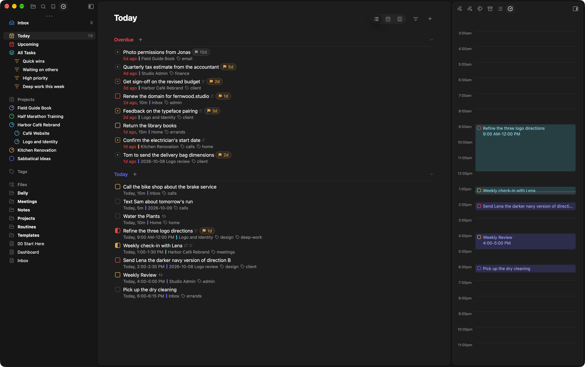

Choose between two **Styles** in settings: **Griply** (the default, shown above), where each task's details sit under its title and tasks open in the task editor, and **Things**, shown at the top of this page, where tasks open as cards in the list. To work in three panes, set **Task details** to **Three panes: in the sidebar**, and tasks open in the Task details sidebar instead.

| Setting | What it does |
| --- | --- |
| **Inbox note** | Where new tasks go when you're not in a project or note |
| **New task position** | Add new and moved tasks at the top or bottom |
| **Section heading level** | Which heading level divides a project into sections |
| **Date format**, **Link dates** | How dates are written; **Update dates** rewrites existing ones |
| **Tag format** | `#tag` or `#[[tag]]`; **Convert notes** rewrites existing tags |
| **Record completion dates** | Add `✓date` when you complete a task |
| **Ignored folders and notes**, **Ignored tags** | Leave out templates, archives or private notes |
| **Style**, **Task details**, **Density** | How lists look and where tasks open |
| **Show files in sidebar** | Keep your vault's files and folders in the task sidebar |
| **Show subtasks in task views** | In the Things style, list subtasks as their own rows |
| **Color calendar tasks by project**, **Color calendar checkboxes by priority** | Tint calendar tasks with their project's colour, and checkboxes with their priority |

Search for **Integrated Task Manager** in the command palette to see every command, and assign hotkeys to your favorites under **Settings → Hotkeys**. If task lists ever look out of date, run **Rebuild task index**.

## Coming from the Tasks plugin

Run **Import tasks from the Tasks plugin**, or choose **Import…** in settings, to convert tasks written for the Tasks plugin, in all notes or just the current one:

| Tasks plugin | Becomes |
| --- | --- |
| 📅 due date | `{deadline}` |
| ⏳ scheduled date | scheduled date |
| 🛫 start date | `>` hidden until |
| ✅ done date | `✓` completion date |
| 🔁 every week | `every week` |
| 🔺 ⏫ / 🔼 / 🔽 ⏬ | `p1` / `p2` / `p3` |
| `#tag` | a tag at the end of the task, if you choose to convert tags |
| `[/]`, `[?]`, `[-]` | kept, as in progress, waiting and cancelled |

Dataview-style fields such as `[due:: 2026-10-01]` are converted too, and your Tasks global filter is removed. You see how many tasks will change, with examples, before anything is written, and the whole import is one change you can undo. Anything it can't convert, such as dependencies, is listed in the preview and left as it is. Tasks query blocks are not touched.

## Manual installation

1. Download `main.js`, `manifest.json` and `styles.css` from the [latest release](https://github.com/kuberrr0/obsidian-integrated-tasks/releases/latest).
2. Put them in your vault's `.obsidian/plugins/integrated-task-manager/` folder.
3. Reload Obsidian and enable **Integrated Task Manager** under **Settings → Community plugins**.

## Contributing

Bug reports, ideas and pull requests are welcome. See [CONTRIBUTING.md](CONTRIBUTING.md).

## License

[MIT](LICENSE)
