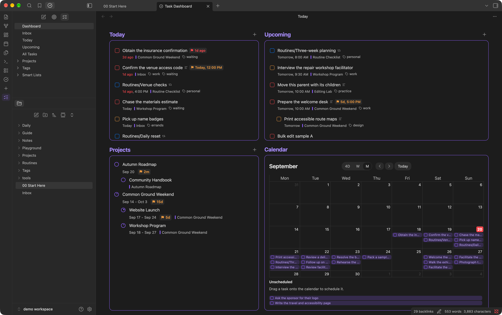

# Integrated Task Manager for Obsidian

Keep your tasks alongside the notes that give them context. Integrated Task Manager brings checklists from across your vault into one place, with lists, calendars, Kanban boards, and project timelines. Complete or edit a task in any view, and the change is saved in its original note.

Start your day with a dashboard of today's work, upcoming tasks, projects, and your calendar.



Works on **desktop and mobile**, with **Obsidian 1.7.2 or newer**. Your tasks stay in your vault; the plugin does not upload your notes or task data to an external service.

## Get started

Once the plugin is enabled, click **Open task manager** in Obsidian's ribbon to open the task sidebar.

1. Open **Inbox** and choose **Add task**.
2. Type something like `Call the venue tomorrow at 9am`.
3. Add a deadline, priority, or other details if you need them, then save.
4. Open **Today**, **Upcoming**, or **Dashboard** to see your plan.

Quick-created tasks go to `Inbox.md` by default. You can choose another inbox note in settings. Checklists already in your notes appear in **All Tasks**.

## Find what needs your attention

| View | Use it to… |
| --- | --- |
| **Dashboard** | Get an overview of your day and projects. |
| **Inbox** | Capture tasks and sort them out later. |
| **Today** | Focus on today's tasks and catch overdue work. |
| **Upcoming** | Look ahead at future tasks, organized by date. |
| **All Tasks** | See tasks from across your vault, including those without dates. |
| **Projects** | Review project progress and open a project's tasks. |
| **Tags** | Bring related tasks together across different notes. |
| **Smart Lists** | Return to your own saved views of the work. |
| **Weekly Review** | Step through what needs attention once a week. |

Today and Upcoming consider both the scheduled date and the deadline, using whichever comes first. Tasks without either date remain available in All Tasks and their source notes.

The top of **Today** shows how your day is going: a progress circle of tasks done against tasks planned, the time you've planned, how many tasks are overdue, and your next timed task with a countdown.

Press **Cmd/Ctrl+K** in a task view, or run **Quick switch to view, project, tag, or task**, to jump anywhere by typing: a view, a project, a tag, a smart list, or an open task by its title.

Search by task title, description, or tag. Narrow the results by priority, dates, duration, status, note, or section. Sort and group the results to suit the way you're working.

For a view you'll use again, choose **Create new smart list**. Save a list such as “Quick wins,” “Waiting on others,” or “High-priority work.” Smart lists update as your tasks change. Deleting a smart list leaves its tasks intact.

## Capture the task and its details

Write dates naturally—such as “tomorrow,” “next Friday,” or “at noon”—or use the task editor's individual fields.


A task can include:

- A **scheduled date and time** for when you plan to work on it.
- A **deadline**, with its own optional time, for when it needs to be finished.
- A **duration** to help you make room for it.
- A **priority**, **tags**, and a **description**.
- A **destination** note or heading, so it lands in the right place.

Break larger tasks into subtasks. You can also paste several tasks into the editor at once, one per line, with indented subtasks underneath. Press **Enter** for another line and **Cmd/Ctrl+Enter** to save.

## Choose a layout

### List: work through the details

Click a checkbox to complete a task, or click its title to edit it. Drag tasks to reorder them or move them between sections and notes. Subtasks and descriptions travel with their parent.

Use the **+** beside a group or heading to add a task there. Click a task's source label to return to the note it came from.

Everything you can do by dragging also works from the keyboard. Long lists show their first tasks straight away and load the rest as you scroll.

| Key | Action |
| --- | --- |
| ↑ / ↓, Home / End | Move between tasks |
| Tab | Reach the focused task's checkbox, title, and details |
| Enter or Space | Open the task |
| Shift + ↑ / ↓ | Select a range |
| Alt + ↑ / ↓ | Move the task up or down among its siblings |
| Alt + → / ← | Make it a subtask of the task above, or move it out of its parent |
| M | Move to another section, column, or note, reschedule it, or snooze it |
| Cmd/Ctrl + Z | Undo the last task change |
| Cmd/Ctrl + K | Jump to a view, project, tag, smart list, or task |

### Calendar: make time for your work

See your schedule across four days, a week, or a month. Day and year views are also available from the command palette.


Drag tasks to a new date or time to reschedule them. In the daily and weekly layouts, drag across empty time slots to create a task, or resize a timed task to change how much time it takes.

Turn on **Plan tasks** to see unscheduled tasks beside the calendar, then drag them into your schedule. Tasks without a time stay in a separate area above the time slots.

The calendar places a task on its scheduled date, or on its deadline if it has no scheduled date.

### Kanban: organize work into columns

Use your note's sections as a board, or group tasks by properties such as priority or status. Drag between supported columns to update the task's section or property. Grouping by **Status** gives you Open and Completed columns.


## Turn notes into projects

Create a project from the task sidebar, or open an existing note and run **Convert to project** from the command palette. Use headings to divide its tasks into sections, and give the project dates, a deadline, and a priority.

Projects show completion progress, including subtasks. Assign a parent project to organize related projects together.

Give a project a colour in the project editor, or with a `color` property such as `color: blue` or `color: "#3b82f6"`. Its tasks' source label takes the colour in mixed lists, board cards get a coloured stripe, and its bar in the Gantt chart uses the colour. Subprojects without their own colour use their parent's.

**Task mode** opens project notes as task views. Opening a project from the Projects list enables it automatically. Turn Task mode off whenever you want to return to the regular note view.

Add the `archived` tag to a project note to hide it from the default Projects list. **Show archived projects** brings it back; its tasks remain available in other task views.

### See the bigger picture with Gantt

Switch Projects to **Gantt** to see your projects on a timeline. Choose month, quarter, year, or five-year views to plan at different scales.


Drag a bar's edges to adjust a project's start and end dates. For a project without a date range, drag across its row to plan one. Changes are saved back to the project note.

## Keep working in your notes

You can continue writing and checking off tasks directly in your notes. In Live Preview and Reading view, the plugin presents task dates, deadlines, and tags alongside the task, with checkbox colors indicating priority.

**Cmd/Ctrl-click a checkbox** to open the task editor. On mobile, **press and hold the checkbox**.

With Task mode off, you can end a checklist item with a natural date, such as “Call the venue tomorrow.” When you press Enter or move off a line you edited, the recognized date becomes a saved schedule. Lines you only move through, completed tasks, and words in the middle of a title are left as you wrote them. Links to notes, such as `[[Friday]]`, stay links; only links in your date format count as dates.

Tags connect related work across your vault. Open a tag from the sidebar to see its tasks; a task created in that view inherits the tag. When a tag has a linked note, Task mode can show that note as a tag task view too.

## Show tasks inside any note

Add a `task-query` code block to a note, such as a daily note, a project hub, or a meeting note, to show a live list of tasks there. Run **Insert task query** to start one:

````
```task-query
title: This week
deadline: before in 7 days
tags: work
sort: priority
```
````

The list updates as your tasks change. Check tasks off, click a title to edit it, or click a date or tag to change it, right from the note. It works in Reading view and Live Preview.

Write one option per line:

| Option | Examples |
| --- | --- |
| `view` | `today`, `upcoming`, `inbox`, `all`, `overdue` |
| `smart list` | `Quick wins` (uses that list's filters, sort, and grouping) |
| `project` | `[[Website Refresh]]`, or `this` for the note the block is in |
| `note` | `this`, `[[Inbox]]` (tasks written in that note) |
| Any property | `priority: 1, 2` · `tags: work or home` · `status: completed` · `repeat: has` · `hidden until: someday` · `task title: contains report` |
| Dates | `deadline: before next friday` · `scheduled: between today and in 7 days` · `completed: after 7 days ago` · `deadline: missing` |
| `search` | words in the title, description, or tags |
| `sort`, `group` | `sort: priority desc` · `group: source` |
| `limit` | how many tasks to show (50 by default), with **Show all** for views and smart lists |
| `title` | a heading for the list |
| `show completed` | `yes` to include completed tasks |

Dates such as `today` or `next friday` are worked out each time the list is shown, so the list stays current. If an option isn't understood, the block says which line and why. The Tasks plugin's `tasks` blocks are left alone, so both plugins can be used side by side.

## Update several tasks at once

Select tasks to change their dates, priorities, tags, or other details together.

| Action | Gesture |
| --- | --- |
| Select a task | Right-click |
| Select a range | Shift + right-click |
| Add to your selection | Cmd/Ctrl + right-click |
| Select a range from the keyboard | Shift + ↑ / ↓ |
| Clear your selection | Click outside the selected tasks, or press Escape while a selected task is focused |

Click a selected task title or run **Edit task properties** to make a shared change. Only the fields you edit are applied; **Mixed — unchanged** preserves each task's existing value.

You can also drag a selection to move tasks together, drop it onto the calendar to reschedule it, or delete selected tasks along with their subtasks.

## Review your week

Open **Weekly Review** from the sidebar, the quick switcher, or the command palette. It walks through what needs your attention, one section at a time:

- **Completed this week**, when completion dates are turned on
- **Overdue** tasks to reschedule, finish, or let go of
- **Routines behind** their date
- **Deadlines in the next 7 days**
- **Untouched for a month**: undated tasks in notes nobody has edited for 30 days
- **Projects without a next action**
- **Someday** tasks, to schedule or delete

Work on tasks right in the review, with the same checkboxes, keys, and swipes as other views. Tick **Reviewed** on each section as you finish it; it folds away, and your progress is kept until the week ends. **Start over** clears it.

## Use it on your phone

Swipe a task to the right to complete it, or to the left to snooze it until tomorrow. Both show an Undo notice, like other changes.

On phones, the task editors open as a sheet from the bottom of the screen. Drag the sheet's handle down to close it.

## Undo a change

After you complete, move, edit, snooze, or delete tasks from a task view, a notice shows what changed with an **Undo** button. You can also press **Cmd/Ctrl+Z** in a task view or run **Undo last task change** from the command palette. The last 20 changes can be undone.

Undo puts your notes back exactly as they were, so it only runs if those notes haven't changed since; otherwise it tells you which note changed. You can turn the notices off in the plugin settings and still undo with the command or shortcut.

## Snooze tasks you can't act on yet

End a task with `>` and a date to hide it from Inbox, Today, and Upcoming until that day, such as `- [ ] Renew passport >Oct 1, 2026`. Use `>someday` to set a task aside with no date. Snoozed tasks still appear in All Tasks, projects, and tags, labelled **Hidden until**, and come back on their own when the date arrives.

In a task view, press **M** on a task and choose a **Snooze** option, or set **Hidden until** for several tasks at once in the bulk editor. In a note, you can type a natural date such as `>tomorrow`; it becomes a date when you move off the line.

## Build recurring routines

For a simple repeat, end the task with a rule such as `every week`, `every 2 weeks`, `every month`, or `every monday`:

```
- [ ] Water plants Sep 28, 2026 every week
```

Completing it moves its date to the next occurrence instead of checking it off; a deadline moves by the same number of days. A repeat with only a deadline repeats from the deadline. Note that a title ending in a rule, such as “Clean every day”, becomes a repeating task.

For habits you want a history of, use a routine note instead:

1. Create a note for the routine, such as **Weekly review**.
2. In that note's properties, add the tag `recurring-task` and a text property named `repeat`, with a value such as `every friday`.
3. In any checklist, link to that note and give the task a scheduled date.

Check off the recurring task to record its completion and advance it to the next occurrence. The task stays open for next time, and its routine note keeps the history.

You can also use **Skip recurring task** or **Fail recurring task** from the command palette. In a regular note, place your cursor on the task first; in Task mode, select one recurring task.

Repeat rules include every day, every week, every other week, every month, every year, and named weekdays. Overdue routines advance one occurrence at a time. Monthly and yearly routines remember the day they started on, so a routine on the 31st returns to the 31st after a shorter month. (Simple repeats don't: they follow the shorter month from then on.) If a task has both a routine note and a rule, the routine note wins.

## Record when tasks were done

Turn on **Record completion dates** in the settings to stamp each task with the day you complete it, such as `- [x] Pay rent ✓Sep 27, 2026`. Reopening the task removes the date. Completed tasks then show a **Done** label, the weekly review lists what you finished this week, and smart lists can filter and sort by **Completed date**. Dates written by the Tasks plugin, such as `✅ 2026-09-27`, are read too.

## Make it fit your workflow

In the plugin settings, you can choose your inbox, decide whether new tasks go at the top or bottom, and select which heading level organizes project sections. Adjust title wrapping, hover highlighting, and task counts, and choose **Comfortable** or **Compact** density to fit more tasks on screen.

Choose your preferred date format and whether dates link to notes. These choices apply to new edits; use **Update dates** to apply them to existing tasks and recurring-task history.

Search for **Integrated Task Manager** in Obsidian's command palette to open views, create tasks, switch layouts, and access other actions. Assign hotkeys to your favorites in Obsidian's Hotkeys settings.

## Coming from the Tasks plugin

Run **Import tasks from the Tasks plugin** from the command palette, or choose **Import…** in the plugin settings. It converts tasks written with the Tasks plugin's emoji or fields, in all notes or just the current one:

| Tasks plugin | Becomes |
| --- | --- |
| 📅 due date | `{deadline}` |
| ⏳ scheduled date | scheduled date |
| 🛫 start date | `>` hidden until |
| ✅ done date | `✓` completion date |
| 🔁 every week | `every week` |
| 🔺 ⏫ / 🔼 / 🔽 ⏬ | `p1` / `p2` / `p3` |
| `#tag` | `#[[tag]]`, if you choose to convert tags |

Dataview-style fields such as `[due:: 2026-10-01]` are converted too, `* [ ]` and `+ [ ]` checklists become `- [ ]`, and your Tasks global filter (such as `#task`) is removed. You see how many tasks will change, with examples, before anything is written. Custom statuses, dependencies, and repeat rules this plugin doesn't support are left as they are and listed in the preview. Tasks query blocks are not touched. The whole import is one change you can undo.

## Manual installation

1. Place `main.js`, `manifest.json`, and `styles.css` in your vault's `.obsidian/plugins/integrated-task-manager/` folder.
2. Reload Obsidian.
3. Enable **Integrated Task Manager** under **Settings → Community plugins**.

## License

[MIT](LICENSE)
